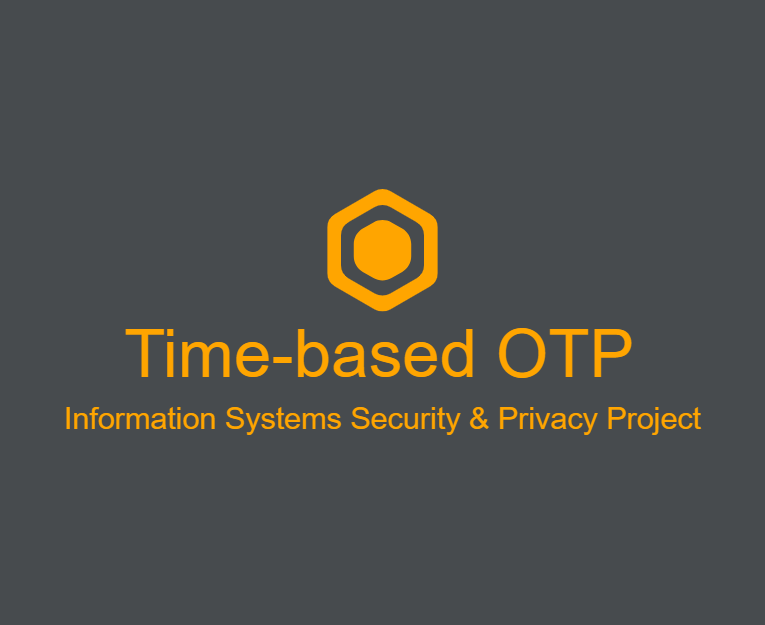

<!-- # totp-project-poliba
A TOTP 2FA in an angular webapp (with spring-boot server)
add this string to run npm run start:
 $env:NODE_OPTIONS = "--openssl-legacy-provider" -->

<!-- Project Logo -->
 

  

  <h3 align="center">
    <a href="https://github.com/federicoder/totp-project-poliba">Time-based OTP</a>
  </h3>

  

    Time-based OTP (Information Systems Security and Privacy Project - Poliba)
     
     
    <a href="https://github.com/federicoder/totp-project-poliba/issues">Report Bug</a>
    ·
    <a href="https://github.com/federicoder/totp-project-poliba/issues">Request Feature</a>
  

<!-- Table Of Contents -->

  
Table of Contents

  <ol>
    <li>
      <a href="#about-the-project">About The Project</a>
      <ul>
        <li><a href="#built-with">Built With</a></li>
      </ul>
    </li>
    <li><a href="#requirements">Requirements</a></li>
    <li><a href="#usage">Usage</a></li>
    <li><a href="#license">License</a></li>
    <li><a href="#contact">Contact</a></li>
  </ol>

<!-- About The Project -->
## About The Project
A Time-based OTP(TOTP) 2FA in an angular webapp with spring-boot server.

### Built With

[![html][html]][html-url] 

[![css][css]][css-url]

[![typescript][typescript]][typescript-url]

[![angular][angular]][angular-url]

[![spring][spring]][spring-url]

[![maven][maven]][maven-url]

[![node][node]][node-url]

[![java][java]][java-url]

## Requirements

1. [Download](https://www.oracle.com/it/java/technologies/downloads/#java17) and Install JDK Development Kit 17.0.10
2. [Download](https://maven.apache.org/download.cgi) and Install Maven v. 3.8.8
3. [Download](https://nodejs.org/download/release/v14.21.3/) and Install Node.js v. 14.21.3
4. [Download](https://www.mysql.com/products/workbench/) and Install MySQL Workbench v. 8.0.36

<!-- Usage -->
## Usage

1. Download ZIP.
2. Open MySQL Workbench and Configure MySQL Istance.
3. Execute SQLscript.sql in MySQL Istance.
4. Go to the "BackEnd" directory.
5. Run the following commands:

    `mvn clean install`

    `mvn spring-boot:run -DSkipTests`

6. Go to the "Client" directory.
7. Run the following commands:

    `npm install`

    `ng serve`

<!-- License -->
## License

Distributed under the MIT License. See `LICENSE` for more information.

<!-- Contact -->
## Contact

Federico D'Errico - f.derrico3@studenti.poliba.it

Mauro Giordano - m.giordano8@studenti.poliba.it

Project Link: [https://github.com/federicoder/totp-project-poliba](https://github.com/federicoder/totp-project-poliba)

<!-- MARKDOWN LINKS & IMAGES -->
<!-- https://www.markdownguide.org/basic-syntax/#reference-style-links -->
[html]: https://img.shields.io/badge/HTML5-E34F26?style=for-the-badge&logo=html5&logoColor=white
[css]: https://img.shields.io/badge/CSS3-1572B6?style=for-the-badge&logo=css3&logoColor=white
[typescript]: https://img.shields.io/badge/TypeScript-007ACC?style=for-the-badge&logo=typescript&logoColor=white
[angular]: https://img.shields.io/badge/Angular-DD0031?style=for-the-badge&logo=angular&logoColor=white
[spring]: https://img.shields.io/badge/Spring-6DB33F?style=for-the-badge&logo=spring&logoColor=white
[maven]: https://img.shields.io/badge/apache_maven-C71A36?style=for-the-badge&logo=apachemaven&logoColor=white
[node]: https://img.shields.io/badge/Node%20js-339933?style=for-the-badge&logo=nodedotjs&logoColor=white
[java]: https://img.shields.io/badge/OpenJDK-ED8B00?style=for-the-badge&logo=openjdk&logoColor=white

[html-url]: https://www.w3schools.com/html/
[css-url]: https://www.w3schools.com/css/
[typescript-url]: https://www.typescriptlang.org/
[angular-url]: https://angular.io/
[spring-url]: https://spring.io/projects/spring-boot
[maven-url]: https://maven.apache.org/
[node-url]: https://nodejs.org/en
[java-url]:https://www.oracle.com/it/java/technologies/downloads/#java17